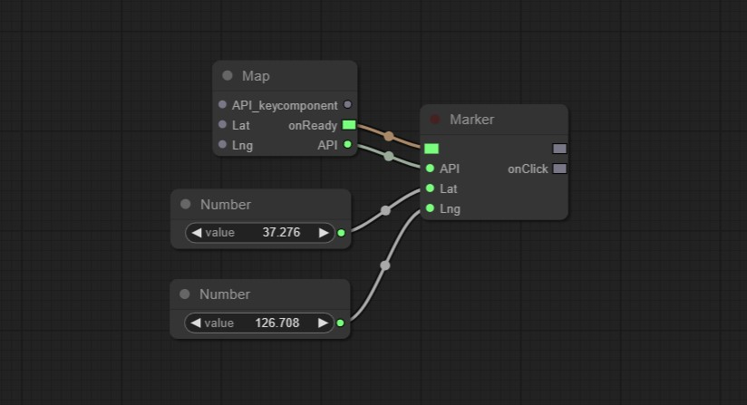

## Kakao Map API 지원 노드 패키지(Nodes)

### Nodes
#### • Map (Kakao/Map)
카카오 지도에 필요한 코드를 로드하고 지도를 띄우는 컴포넌트와 API를 반환합니다.

아래의 다른 노드를 사용하려면 반드시 *Map* 노드는 포함되어야 합니다.

> fbrc 예시

 
#### • Marker (Kakao/Map_extra/Marker)
카카오 지도위에 마커를 표시합니다.

> fbrc 예시
